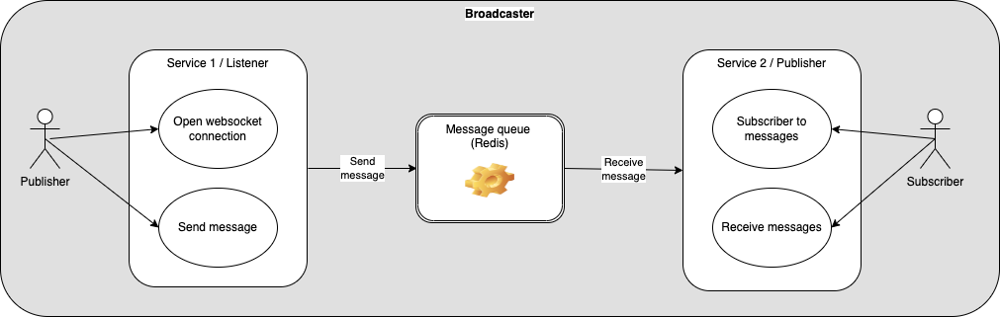
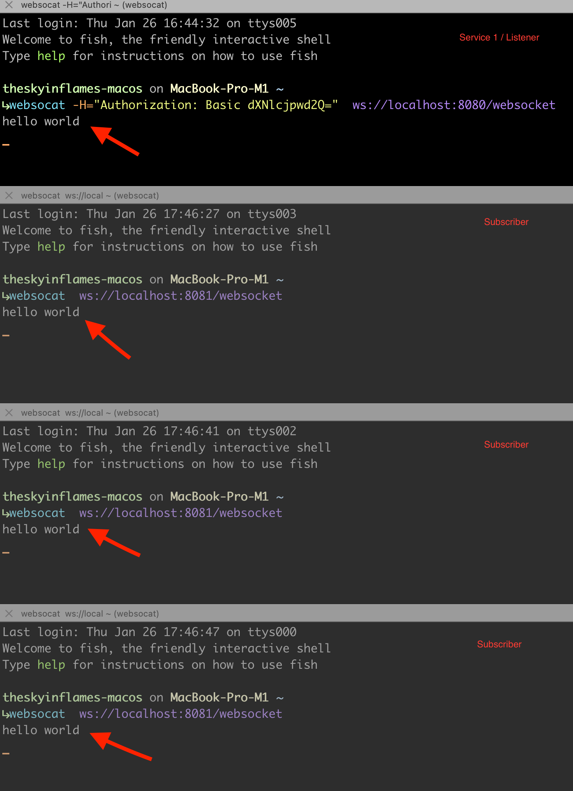

# The Core-Tech Challenge - Broadcaster
This code challenge consist on to implement two services following these instructions:
```
## Create two microservices for real time messages using websockets, and at least one demo subscriber.

### Functionality
1. The first service should listen for incoming messages through the websocket protocol and when a new one arrives, the message should be published into message queue
1. The second service should listen for incoming messages through the message queue and when a new message arrives, the message should be published to all the subscribers through the websocket protocol

### Other Requirements
* At least one of the services should have tests
* Make sure your code is well structured and maintainable (including tests)
* You can use frameworks and technologies by your choice, but the language for the microservices should be Javascript (node) or Go (or both).
* The source code should be hosted online using github (or similar service)

Note, this is your chance to impress us, take this opportunity to show us what you can do! You can include authentication, use any CI, container based deployment or whatever you think will grab our attention.
```

## Big Picture

I've implemented two services:

* **Service 1/Listener**: This service is in charge of receiving messages to be broadcasted to subscribers, and publish them to a message queue.

* **Service 2/Publisher**: This service is in charge of accepting subscribers, and reading messages from the message queue and broadcast them to the subscribers.



## Architecture

To implement the two services, I've applied these architectural patterns:

* Basic Auth (service 1)
* Hexagonal architecture (services 1 and 2)
* CQRS (service 2)
* Event-Driven (service 2)

## How to start it locally

There is a Make file in the root for that. Only do:

```sh
  make docker-run
  make docker-logs
```

These commands will start three container:

* A Redis container wich will act as message queue

* A listener service (first service) in charge of receive messages by a websocket connection and push them to the message queue (Redis).

* A publisher service (second service) in charge of read messages from the messages queue and broadcast them to the subscribers.

## How to try it

1. First open a websocket connection to the first service. To do that I use the [websocat tool](https://github.com/vi/websocat) This service uses Basic-Authorization (by default user/pwd)j

```sh
    websocat -H="Authorization: Basic dXNlcjpwd2Q="  ws://localhost:8080/websocket
```

2. Open so many subscriber as you want. To do that, open a websocket connection to the second service (publisher):

```sh
    websocat  ws://localhost:8081/websocket
```

3. From this moment you can start passing messages to the listener and see how all the subscribers receive these messages.



## How to test it

The two services includes unit tests:

* Service 1:

```sh
    cd listener
    make test-unit
```

* Service 2:

```sh
    cd publisher
    make test-unit
```

## Repo layout

* assets - images of this document
* listener - service 1, in charge of receiving message by websocket connection and pushing them to a message queue
* publisher - service 2, in charge of read messages from messages queue and broadcast them to the subscribers

* For each service:
    * cmd - where the *main.go* is
    * internal - used to [reduce the public API surface](https://dave.cheney.net/2019/10/06/use-internal-packages-to-reduce-your-public-api-surface)
    * internal/app - CQRS layer, application services
    * internal/domain - where the domain entities and business rules lives
    * internal/helpers - misc helpers used to improved the code reading
    * internal/infra - infrastructure layer

There are also other files used for development purposes:

  * docker-compose.yml 
  * Makefile

## Tooling and libs used

To implement the solution I've used:

* Go libs:
	* github.com/getlantern/httptest v0.0.0-20161025015934-4b40f4c7e590
	* github.com/go-chi/chi v1.5.4
	* github.com/go-redis/redis/v7 v7.4.1
	* github.com/gobwas/ws v1.1.0
	* github.com/rs/cors v1.8.3
	* github.com/stretchr/testify v1.8.1
	* github.com/google/uuid v1.3.0
	* github.com/theskyinflames/cqrs-eda v1.2.5

* Tooling:
  * MacOS Ventura 13.1
  * Go 1.19.4
  * Docker 20.10.22
  * GNU Make 4.3
  * websocat 1.11.0

## Dockerfile building strategy

I've opted for optimizing the Docker image size by [multi-stage building](https://docs.docker.com/build/building/multi-stage/). So only the binary is added in the resulting image.
